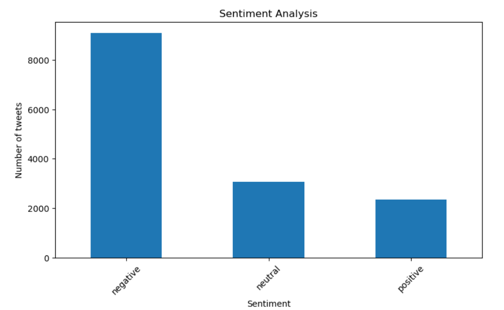
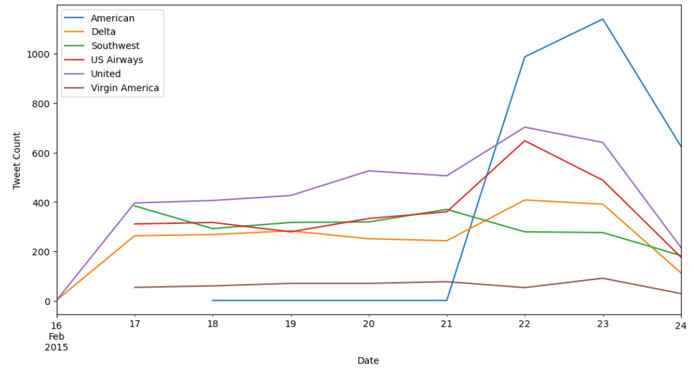
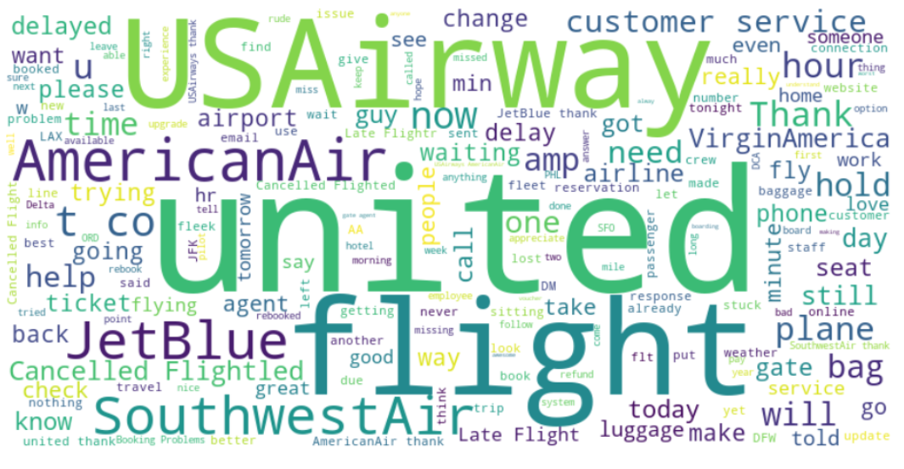
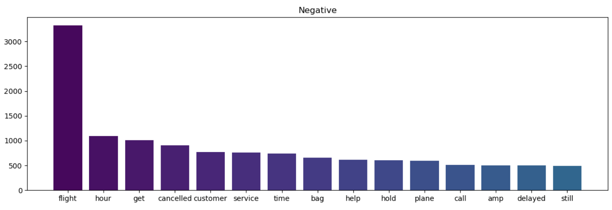

# SEMANTIC ANALYSIS OF AIRLINE TWEETS

Authors: Scholar Chepkirui | Moses Kuria | Penina Wanyama | Stephen Thuo

## Overview
In the highly competitive airline industry, leveraging sentiment analysis can provide a competitive edge. By analyzing social media posts, sentiment analysis can determine whether the sentiment of the feedback is positive, negative, or neutral. This can provide valuable insights into customers' opinions and preferences, aid in identifying common complaints, monitor trends in customer feedback, and enable the development of targeted strategies to enhance customer satisfaction and loyalty.  

## Business Problem

The airline industry is constantly facing challenges that require them to innovate and improve their service offerings, all while keeping their operational costs low. By gaining a deeper understanding of customer preferences through NLP, airlines can take proactive measures to improve overall customer satisfaction. Using machine learning techniques, airlines can accurately predict the sentiment of their passengers based on their tweets. This means that they can quickly identify and address any issues before they escalate, reducing the likelihood of negative customer experiences and increasing customer loyalty.

## Data
The airline_tweets dataset was obtained from [Kaggle](https://www.kaggle.com/datasets/crowdflower/twitter-airline-sentiment). Data was scraped from Twitter and contributors were asked to first classify positive, negative, and neutral tweets.

## Methods
This project uses NLP, Sentiment analysis techniques and Neural Networks. The steps taken business understanding, data understanding, data preparation, modeling and evaluation.

### Exploratory Data Analysis
Number of Tweets per Airline: There are a total of 6 airlines.

Distribution of sentiment categories

Tweets trend over time

200 most frequently used words in the tweets

### Data Preparation
- Checking for missing values and duplicates
- Preprocessing the text to remove emojis, punctuation, stopwords, hyperlinks and lemmatize the words 
- After tokenization, the top 15 words in the negative and positive sentiment category are plotted.

Common words in the tweets with negative sentiments: hour, cancelled, customer, service, time, delayed, call.  
Common words in the tweets with positive sentiments: thanks, great, service, customer, time, best.

- Splitting the data into train, test and validation sets
- One-hot encoding the texts and encoding the categorical labels
- Padding the sequences to a fixed length

### Modeling
The sentiment analysis techniques, TextBlob and VADER, were used to analyze and classify the sentiment of textual data. 
Recursive Neural Networks, Simple RNN and LSTM,are used to build models that classify the tweets as either positive, negative or neutral. These models are capable of learning dependencies between words and maintaining context over long sequences, making them useful for tasks like sentiment analysis and text classification. 
The basic Simple RNN and LSTM models were overfitting. Various techniques such as regularization, early stopping and reducing model complexity were used to reduce overfitting. RandomSearchCV was used for hyperparameter tuning to get an optimal random set of hyperparameters.
The table below shows a comparison between the metrics of the various sentiment analysis techniques and Recursive Neural Networks.

The best model is the tuned LSTM model. On evaluating the model using the test data, the model has the highest recall(76.0%) and f1_score(77.3%). It also has the lowest loss(0.651).

## Conclusions and recommendations
Based on the common words in the tweets with negative and positive sentiments, the airline should focus on improving their customer service, punctuality, and communication with passengers.
For the negative sentiment tweets, the frequent use of words such as "cancelled", "delayed", and "hour" suggests that customers are experiencing issues with flight schedules and disruptions, which can be frustrating and stressful. 
For the positive sentiment tweets, the frequent use of words such as "thanks", "great", and "service" suggests that customers appreciate good customer service and value when it is provided

Since a recurrent neural network model has been built to automatically classify airline sentiments, the airline can use this model to gain insights into how customers are feeling about their experiences with the airline. The airline should:
- Focus on improving the areas that are leading to negative sentiment.
- Celebrate positive experiences.
- Tailor customer service interactions based on sentiment.

## Future work
The airline tweets should be monitored in real-time. A pipeline that automates the process of collecting, preprocessing, analyzing, and visualizing social media data should be set up.  
By leveraging the machine learning model to monitor sentiment in real-time, the airline can quickly identify and address any issues that arise. This can help to prevent small problems from escalating and causing widespread negative sentiment among customers.

##  For More Information
See the full analysis in the [Jupyter Notebook](https://github.com/Scholarchep/semantic-analysis-of-airline-tweets/blob/main/airline_tweets.ipynb) or review this [presentation](https://github.com/Scholarchep/semantic-analysis-of-airline-tweets/blob/main/presentation.pdf).

## Repository Structure
 
├── data                                      <- Both sourced externally and generated from code  
├── images                                    <- Both sourced externally and generated from code  
├── README.md                                 <- The top-level README for reviewers of this project  
├── airline_tweets.ipynb                      <- Narrative documentation of analysis in Jupyter notebook      
├── presentation.pdf                          <- PDF version of project presentation 
